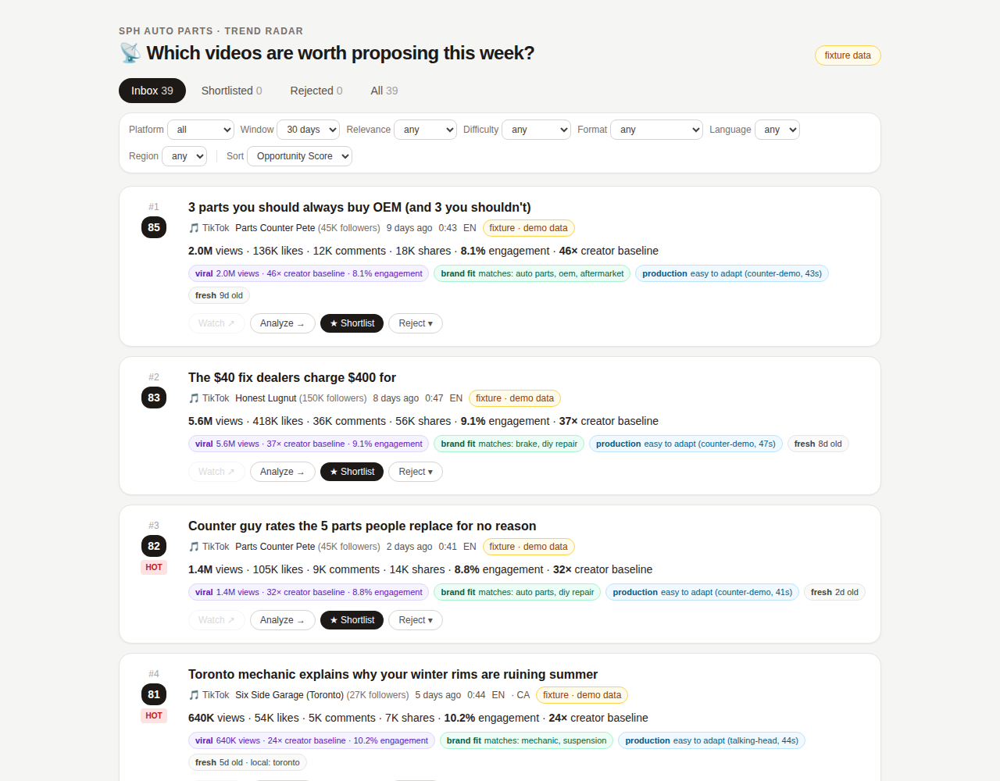

# Implementation Report — Iteration 2: Trend Radar

**Date:** 2026-07-04 · **Status:** ✅ complete, all validations green · **Awaiting:** approval to start Iteration 3 (Opportunity Detail)



## What was built, mapped to your six requirements

1. **Clear ranking with visible reasons.** Every card shows its rank, its Opportunity Score, and **four reason chips** — `viral 2.0M views · 46× creator baseline · 8.1% engagement`, `brand fit matches: auto parts, oem`, `production easy to adapt (counter-demo, 43s)`, `fresh 9d old · local: toronto`. The page footer states the ranking formula. No bare numbers anywhere.
2. **Immediate evidence.** Views, likes, comments, shares, engagement rate, overperformance multiple, publish age, duration, creator + followers, platform, language/region, and a **provenance + confidence badge** (`fixture · demo data` now; `official-api · high confidence` / `scraper · est.` when real providers land) — all on the card. Nothing requires opening the detail page.
3. **Fast decisions.** Shortlist is one click; Reject is two (button → inline reason menu, no modal). Cards leave the Inbox instantly and the tab counts tick down — the pile visibly shrinks. All decisions are reversible (`Remove ★`, `Reopen`), which the state machine now permits explicitly.
4. **Agency-workflow filters.** Platform · time window (7/14/30d) · business relevance (high/medium/low from brand fit) · difficulty to reproduce (easy/moderate/heavy from the production heuristic) · content format · language · region *(dropdowns only offer values that exist in the data; region honors "when available" — many videos legitimately have none)*. Filters live in the URL → any filtered view is shareable. Plus Inbox/Shortlisted/Rejected/All tabs and sort by Score / raw views / newest.
5. **Rejections are learning signals.** Every rejection writes a reasoned decision to the Knowledge Base port (SQLite adapter for now, platform KB later) and a transparent penalty (max −15, from creator/format/tag overlap with rejected items) re-ranks similar cards — shown as its own amber chip, e.g. `−8 similar to 1 rejected (counter-demo)`. The base score is never mutated. During validation this visibly reordered the feed: after one rejection, an unrelated Toronto card overtook a similar-to-rejected card.
6. **Next obvious action on every card:** Watch ↗ (disabled with an honest tooltip on fixture URLs; live link once real providers supply working URLs) · Analyze → (routes to the Iteration-3 Opportunity Detail stub) · ★ Shortlist · Reject ▾.

No deep AI analysis was added — per instruction, that's Iteration 3's Opportunity Detail.

## Static validation

| Check | Result |
|---|---|
| `tsc --noEmit` (strict) | ✅ 0 errors |
| `eslint` | ✅ 0 errors, 0 warnings |
| `next build` | ✅ radar route 2.26 kB page JS, ~108 kB first load |

## Runtime validation — 34/34 checks passed

Playwright against the production build, fresh seed (39 fixtures). Every assertion cross-checks the DOM against direct SQLite queries. Highlights beyond Iteration 1's suite:

```
PASS rank #1 matches DB top score              PASS platform filter: only YouTube cards (12)
PASS evidence row complete (6 fields)          PASS difficulty filter narrows feed (heavy=1)
PASS all four score chips with reasons         PASS language filter matches DB (fr=2)
PASS four actions present                      PASS shortlist persists to DB + right card in tab
PASS rejection recorded in KB with reason      PASS learning chip appears on similar cards (14)
PASS rejected card + reason in Rejected tab    PASS reopen returns card to discovered
PASS KB keeps decision after reopen            PASS hub pipeline shows 1 shortlisted
PASS no horizontal overflow at 420px (hub + radar)
```

Screenshots: [`assets/radar-top.png`](assets/radar-top.png) · [`assets/radar-mobile.png`](assets/radar-mobile.png)

**Worth noting:** the first validation run failed two checks — the test was reading the DOM before client-side tab navigation finished (the database was correct throughout; the fix was in the test's wait conditions, not the app). Diagnosing it produced live proof that the learning re-ranking works: the stale DOM snapshot showed the feed already reordered around the rejection.

## Design decisions made in this iteration (flagged for your review)

- **Reversibility over ceremony:** `rejected → discovered` (reopen) and `shortlisted → discovered` were added to the state machine. Fast curation needs a safety net; the KB keeps every rejection decision even after reopen, so learning history survives.
- **Learning stays transparent and bounded:** overlap heuristic (creator +6, format +3, tags up to +3 per rejected item), capped at −15 of a 100-point score, always rendered as a chip. It cannot silently bury anything.
- **Facet-driven dropdowns:** filter options are computed from the actual data, so the UI never offers a filter value with zero results.

## Known limitations

1. Learning matches on surface traits (creator/format/tags), not semantics — an embedding/LLM upgrade fits behind the same `computeLearningAdjustments` shape later.
2. Language/region coverage mirrors reality: only 2 French and ~14 region-tagged fixtures; region on real scraped data is often absent (the filter says so in its tooltip).
3. Rejection reasons are captured but not yet *differentiated* in learning (an "off-brand" rejection and a "seen-it" rejection weigh the same). Worth revisiting once real strategists generate reason distributions.
4. Single-user PoC: decisions are attributed to a fixed `strategist` actor until platform identity arrives at integration.

## Proposed next iteration (awaiting your approval)

**Iteration 3 — Opportunity Detail:** full evidence panel (metrics, creator context, score anatomy, decision history), state-aware actions, and the *placement* for deep AI analysis — with the actual Claude adapter arriving in Iteration 4 per the phase plan.
