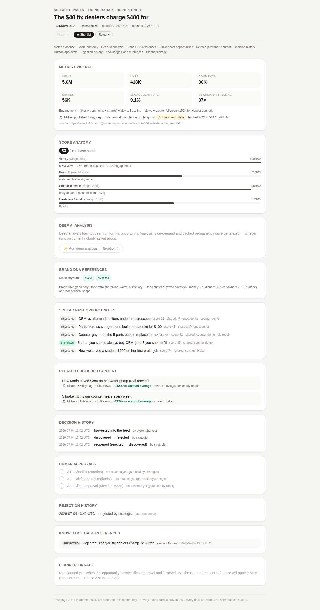

# Implementation Report — Iteration 3: Opportunity Detail (Permanent Evidence Page)

**Date:** 2026-07-04 · **Status:** ✅ complete, all validations green · **Awaiting:** approval to start Iteration 4 (Deep AI Analysis engine)



## What was built

`/opportunity/[id]` is now the **single source of truth for one Opportunity** — a permanent decision record, not a today-only pitch. All ten required evidence groups plus the AI-analysis frame render as eleven modular sections with on-page navigation:

| # | Section | What it shows (verified live) |
|---|---|---|
| 1 | Metric evidence | All six metrics as stat tiles, the engagement/baseline math spelled out, platform/format/duration/language/region, provenance + confidence badge, **fetch timestamp**, source URL |
| 2 | Score anatomy | Each component with **its weight (40/25/20/15%)**, a value bar, and its plain-language reason; base total + HOT; live learning adjustment shown separately from the frozen base score |
| 3 | Deep AI analysis | Honest placeholder: "not yet analyzed", disabled Run button labeled Iteration 4 — **a section of the page, not the page** |
| 4 | Brand DNA references | Matched niche keywords / product lines / traits as chips; **guardrail conflicts as a red warning** (verified on the street-takeover fixture); Brand DNA read-only via its port |
| 5 | Similar past opportunities | Top 5 by shared traits (creator/format/tags — same `similarity.ts` definition the learning penalty uses), each with state badge, score, and link |
| 6 | Related published content | Client's past posts sharing tags, with views and **±% vs account average** — via the new read-only `PublishedContentPort` (fixture adapter; real platform adapter at integration) |
| 7 | Decision history | Full `stateHistory` timeline: harvest event, every transition, actor, timestamp, notes |
| 8 | Human approvals | The three-gate contract (A1 shortlist / A2 brief approval / A3 client approval) with passed-by-whom-when or an honest "not reached yet" |
| 9 | Rejection history | Active rejection and/or past rejections — **survives reopen** (verified: the reopened card still shows its rejection with "later reopened") |
| 10 | Knowledge Base references | Every KB decision row for this opportunity (kind, summary, reason, timestamp) |
| 11 | Planner linkage | Honest not-planned state naming the `PlannerPort` contract; shows the planner reference once an opportunity reaches `planned` (Phase 3) |

## The modularity contract (how future sections plug in)

The page is a **section registry** (`SECTIONS` array in `src/app/opportunity/[id]/page.tsx`): ordered entries of `{ id, title, render(dossier) }`, each rendering inside the shared `DetailSection` shell (consistent header, anchor, empty states). All data flows from one `OpportunityDossier` object assembled in `src/core/services/dossier.ts` from ports only.

Adding hook analysis, scenario extraction, content angles, emotional triggers, suggested adaptation, production difficulty, estimated cost, or expected business value = **one component + one registry entry** (+ a dossier field if new data is needed). The page layout, header, and navigation adapt automatically. No redesign.

## Reuse worth noting

- Similarity now has **one definition** (`src/core/services/similarity.ts`), extracted from the learning service and shared by the learning penalty, the Similar-opportunities section, and the related-published matcher.
- `explainBrandFit()` was extracted from the scoring internals so the score component and the Brand-DNA section can never disagree about what matched.
- The detail header reuses the Radar's `CardActions` (with the self-referencing Analyze link hidden) — decisions made here persist through the same state machine and KB log.

## Static validation

| Check | Result |
|---|---|
| `tsc --noEmit` (strict) | ✅ 0 errors |
| `eslint` | ✅ 0 errors, 0 warnings |
| `next build` | ✅ detail route 1.49 kB page JS |

## Runtime validation — 51/51 checks passed (first run)

The suite now walks the full journey: Hub → Radar → filters → shortlist/reject/reopen → **Analyze → dossier**. New Iteration-3 checks, all DOM-vs-SQLite cross-checked:

```
PASS Analyze navigates to Opportunity Detail    PASS all 11 dossier sections render
PASS metric evidence matches DB views           PASS provenance + fetched timestamp shown
PASS score anatomy shows all four weights       PASS decision history includes harvest event
PASS rejection history survives reopen          PASS KB reference row shown (rejected decision)
PASS related published content found            PASS planner linkage honest not-planned state
PASS AI analysis is a placeholder (disabled)    PASS similar listed (5) + link navigates
PASS gate A1 passed for shortlisted opp         PASS gate A3 honestly not reached
PASS guardrail conflict surfaced (street racing, crash)
PASS no horizontal overflow at 420px (hub + radar + detail)
```

Screenshots: [`assets/detail-desktop.png`](assets/detail-desktop.png) · [`assets/detail-mobile.png`](assets/detail-mobile.png)

The validated dossier is the richest possible with current data — the card that was rejected, logged to the KB, and reopened during the suite shows: 3-event decision history, rejection history with "(later reopened)", the KB rejected-decision row, 5 similar opportunities (one shortlisted), and 2 related published posts with performance deltas.

## Known limitations

1. **Approvals A2/A3 can't be exercised yet** — briefing and Meeting Mode arrive in Phase 2; the gates render their contract honestly ("not reached yet").
2. Published-content fixtures are 5 hand-written posts; the real `PublishedContentPort` adapter (platform content history) replaces them at integration.
3. Similarity remains trait-based (creator/format/tags), consistent with the learning signal; semantic upgrade fits behind the same interface.
4. `fetchedAt` shows one snapshot; metric history over time (re-fetch snapshots) is a future concern for the velocity story.

## Proposed next iteration (awaiting your approval)

**Iteration 4 — Deep AI Analysis engine:** Claude adapter behind the existing `AnalysisEngine` port with a fixture fallback (app never hard-fails without a key), triggered by the Run button in the analysis section, cached permanently on the opportunity, rendering why-it-worked / transferable pattern / client-specific angles / watch-outs / verdict + confidence.
