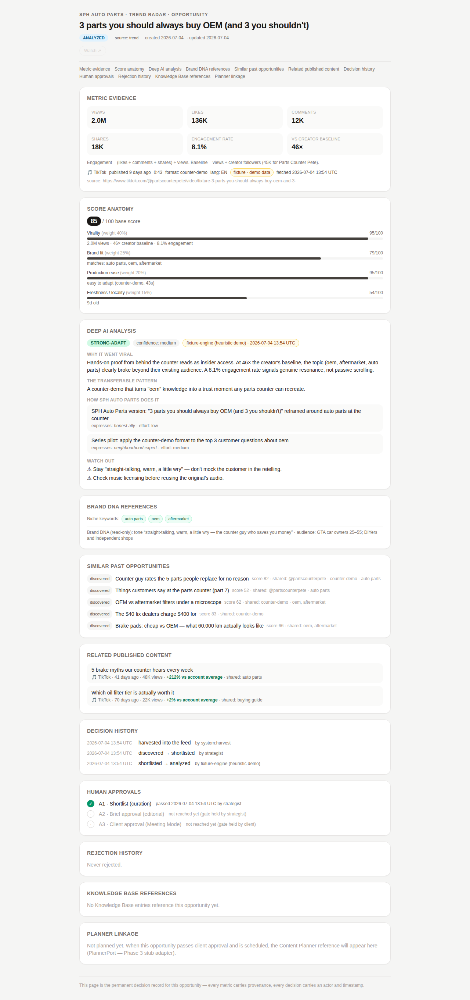

# Implementation Report — Iteration 4: Deep AI Analysis Engine

**Date:** 2026-07-04 · **Status:** ✅ complete, all validations green · **Awaiting:** approval to start Iteration 5 (Brief Editor — Phase 2)



## What was built

The Deep AI Analysis engine behind the existing `AnalysisEngine` port, honoring the design doc's Tier-2 rules: **on explicit human request only, gated behind shortlisting, cached permanently, never the page itself** — it fills the analysis section of the Opportunity Detail dossier.

| Piece | Delivered |
|---|---|
| **Claude adapter** (`src/adapters/analysis/claude.ts`) | `claude-opus-4-8` (env-overridable via `CI_ANALYSIS_MODEL`), adaptive thinking, **structured outputs** (`output_config.format` JSON schema — the response always parses into `OpportunityAnalysis`), refusal/truncation handling, typed error chain (auth / rate-limit / connection / API) surfaced as readable messages in the UI |
| **Fixture fallback** (`src/adapters/analysis/fixture.ts`) | Deterministic heuristic analysis derived from the video's format mechanics, real metrics, and `explainBrandFit()` — including a correct `skip` verdict on guardrail conflicts. Labeled `fixture-engine (heuristic demo)` with an amber badge; the Claude engine gets a green badge. The app never hard-fails without a key |
| **Engine selection** | Container picks Claude iff `ANTHROPIC_API_KEY` is set — zero-config demo mode, one env var to go live |
| **Gate & cache semantics** | `runDeepAnalysis` server action: refuses on `discovered`/`rejected` ("shortlist first — cost follows curation"), returns the cached analysis if present (never regenerates silently), advances `shortlisted → analyzed` through the state machine with the **engine recorded as the actor** in decision history |
| **Persistence** | `analysis` field on the Opportunity + `analysis_json` column (with migration for existing stores); survives reloads and restarts |
| **UI** | Analysis section renders verdict badge (strong-adapt / possible-adapt / skip), confidence, engine provenance + timestamp, "why it went viral", the transferable pattern, client-specific adaptation angles (each tagged with the Brand DNA trait it expresses + effort), and watch-outs. Analyzed items stay in the Radar's Shortlisted tab; hub pipeline "Analyzed" chip counts and links |

## Static validation

| Check | Result |
|---|---|
| `tsc --noEmit` (strict) | ✅ 0 errors |
| `eslint` | ✅ 0 errors, 0 warnings |
| `next build` | ✅ detail route 1.83 kB page JS |

## Runtime validation — 63/63 checks passed

Full journey now validated end-to-end: Hub → Radar → filters → shortlist/reject/reopen → dossier → **gated run → analysis → cache**. New Iteration-4 checks:

```
PASS analysis gated on discovered opp (shortlist first)   PASS run button enabled on shortlisted opp
PASS analysis result renders after run                    PASS verdict + confidence + all narrative sections
PASS engine provenance shown (fixture engine, labeled)    PASS analysis cached in DB
PASS state advanced to analyzed                           PASS cached analysis renders on reload (no re-run)
PASS decision history records shortlisted → analyzed      PASS analyzed card remains in Shortlisted tab
PASS hub pipeline shows 1 analyzed
```

Screenshot: [`assets/analysis-desktop.png`](assets/analysis-desktop.png) — the analyzed dossier with verdict, angles, and the engine honestly badged as heuristic demo output.

## Design decisions (flagged for review)

1. **Cost follows curation, enforced in code:** the server action rejects analysis on un-shortlisted items — the design doc's gate A1 is now a hard rule, not a convention.
2. **Analysis actor in the audit trail:** the `shortlisted → analyzed` transition is attributed to the engine id (e.g. `fixture-engine (heuristic demo)` or `claude:claude-opus-4-8`), so the permanent record always shows *which* engine produced the cached analysis.
3. **No silent regeneration:** a cached analysis is final for the PoC. A deliberate "re-analyze" affordance (with version history) is a future decision, not a default behavior.
4. **Errors are shown, not swallowed:** if the Claude call fails (bad key, rate limit, network), the exact reason renders under the button — the strategist is never left with a spinner.

## Honest limitations

1. **The Claude path is code-complete but not exercised in this sandbox** — no `ANTHROPIC_API_KEY` here, so runtime validation ran the fixture engine (that's the point of the fallback). First run with a real key on your machine is the remaining verification: `echo "ANTHROPIC_API_KEY=sk-..." >> .env && npm run dev`, shortlist a card, hit Run.
2. Fixture analyses are transparently formulaic — good enough to validate the *workflow* with test users, clearly badged so nobody mistakes them for real insight.
3. Analysis quality with real data depends on evidence richness; when real harvesters land (transcripts, comments), the prompt has room to grow without changing the port.

## Proposed next iteration (awaiting your approval)

**Iteration 5 — Brief Editor (Phase 2):** the convergence point where an analyzed opportunity becomes a pitchable one-page brief — AI-drafted from the cached analysis, human-owned, with the `briefed → approved` gate (A2) — per design doc Screen 5.
